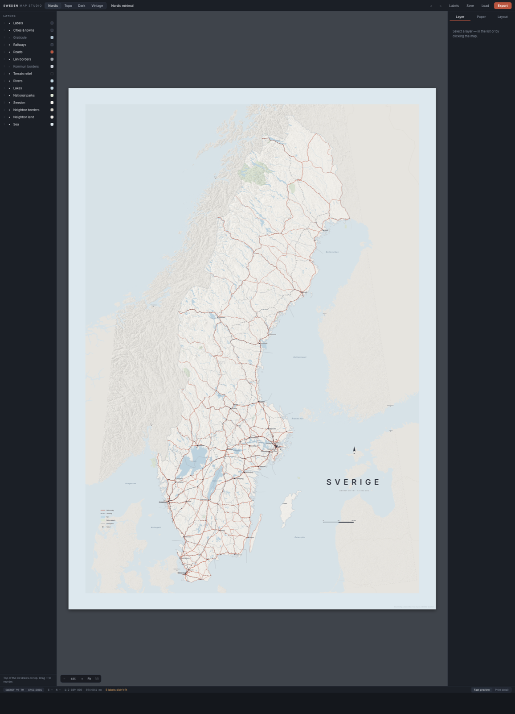
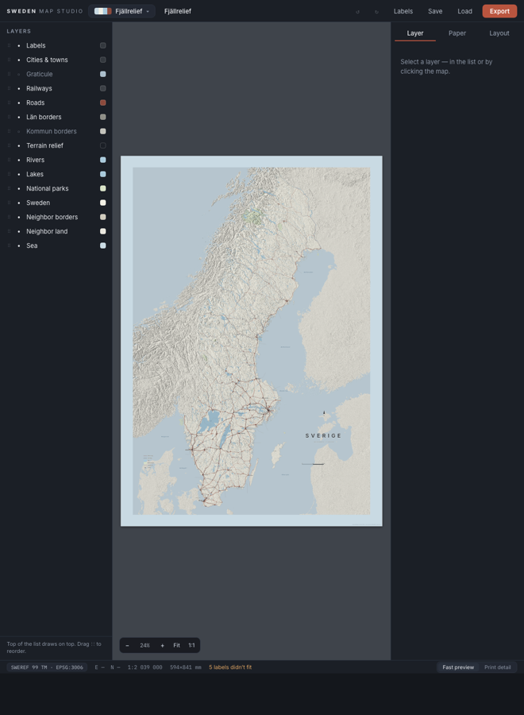
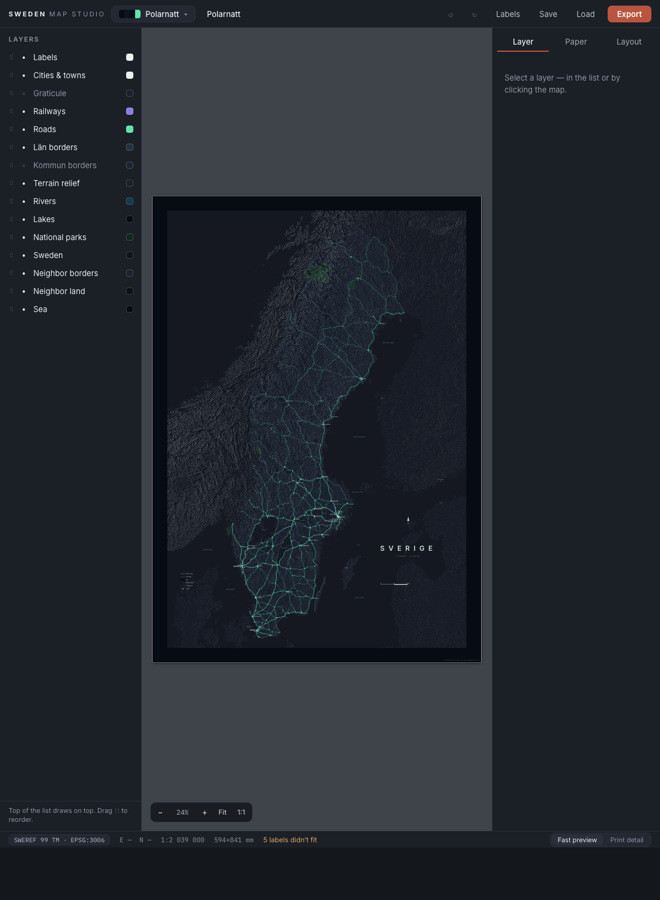

# Sweden Map Studio

A local web app for designing a fully custom, print-ready poster map of Sweden.
Every layer is live-adjustable (color, stroke, opacity, draw order, per-layer filters),
every design is a reproducible JSON *recipe*, and exports are true vectors at exact
physical size. Design decisions are documented in [`SPEC.md`](SPEC.md).



| Fjällrelief (Imhof-style relief) | Polarnatt (aurora night) |
|---|---|
|  |  |

## Quick start

```bash
brew install gdal        # one-time system dependency for the data pipeline
pnpm install
pnpm pipeline            # downloads ~1.7 GB source data, processes to ~10 MB TopoJSON (15–30 min, resumable)
pnpm dev                 # → http://localhost:5173
```

## Using the studio

- **Layers panel (left)** — click to select, `●` toggles visibility, drag `⋮⋮` to change draw order
  (top of list = drawn on top). Hover `⧉` duplicates a layer into an independent instance —
  e.g. big lakes bold above a faint all-lakes wash — renameable and deletable in the Inspector.
- **Inspector (right)** — the selected layer's colors, widths, opacity, and filters
  (road classes with per-class overrides and casings, E-road shields, min lake area,
  river/ferry/trail length thresholds, contour interval, waterline ring count, city
  population thresholds…). The Paper tab sets size (A0/A1/A2/50×70/custom) and the optional
  white frame; the Layout tab drives title, legend, scale bar, north arrow, attribution —
  plus **color harmony** (derive all tints from one anchor color, optionally locked to the
  land color) and **palette-from-image** (extract a photo's palette onto the map).
- **Presets (top)** — ten styles in the gallery picker: Nordic, Fjällrelief (Imhof-style relief hero), Topo,
  Vintage, Etsning (b/w etching), Sextiotal (mid-century tourism), Dark, Polarnatt (aurora night),
  Cyanotype (blueprint), Blågul (flag duotone). Applying one replaces the design but keeps your paper size;
  `?preset=aurora` in the URL opens any preset fresh.
- **Labels button** — label-edit mode: drag any place name; offsets persist in the recipe. Undo with ⌘Z.
- **Viewport** — wheel scrolls, pinch or ⌘-wheel zooms, drag pans, double-click fits, `1:1` shows true print size.
- **Save / Load** — recipes as `.json` files (also autosaved to localStorage).

## Export

| Format | Path | Notes |
|---|---|---|
| SVG | Export → SVG | Vector master, print-tier detail, styles inlined. Install the [Inter](https://rsms.me/inter/) font locally for identical text rendering in Illustrator/Inkscape. |
| PDF | Export → PDF | Opens a print route sized exactly to the paper; use the browser dialog's "Save as PDF" for a vector file a print shop can use. |
| PNG | Export → PNG 300/150 dpi | Raster proof / online print services. |

Terrain relief is the one raster layer — hide it before exporting for a 100 % vector file.
Its blend mode is switchable: *multiply* darkens (light themes), *screen* inverts the shade into a glow (dark themes).

## Data & licenses

| Source | Used for | License |
|---|---|---|
| [Geofabrik Sweden extract](https://download.geofabrik.de/europe/sweden.html) (OSM) | borders, lakes, rivers, roads, E-routes, railways, ferries, hiking trails, parks, places, lighthouses, airports, castles | ODbL — keep the attribution line on published posters |
| [osmdata land polygons](https://osmdata.openstreetmap.de/) | coastline & islands | ODbL |
| Natural Earth 10m | neighbor national borders | public domain |
| Copernicus DEM GLO-90 | hillshade, contour lines | free, © ESA attribution |
| [NOAA ETOPO 2022](https://www.ncei.noaa.gov/products/etopo-global-relief-model) | bathymetry depth bands | public domain, attribution appreciated |

Lantmäteriet's CC0 Topografi products (Geotorget account required) can later replace
borders/railways — drop the GeoPackage layers into the pipeline and re-run.

Projection: **SWEREF99 TM (EPSG:3006)**; data is pre-projected in the pipeline.

## Repository layout

```
pipeline/src/   numbered steps: download → gpkg → extract → curated → shape → terrain → manifest
data/raw|work/  downloads & intermediates (gitignored)
app/            Vite + React + TS studio; public/data/ holds the generated TopoJSON (gitignored)
```

`pnpm pipeline` is resumable via `data/work/.done-*` markers; `FORCE=1 pnpm pipeline` re-runs everything.

## Adapting to another country

Every country-specific fact lives in **`pipeline/country.json`**: the Geofabrik extract URL,
projection EPSG + CRS label, OSM country name and admin levels, the projected frame, the DEM
tile sweep, graticule extents, curated sea/neighbor labels, always-shown priority cities, and
the chrome/legend label strings. The pipeline reads it in every step and bakes it into
`manifest.json`, which is where the app learns *all* of it — the app source contains no
hardcoded country facts.

To try, say, Norway: edit `country.json` (extract URL, `epsg: 25833`, `osmCountryName: "Norge"`,
admin levels 4/7, a new frame, curated content), then `FORCE=1 pnpm pipeline`. Layer ids
(`sweden`, `lan`, `kommun`, …) are stable slot names used by recipes — only their labels change.
Preset titles ("SVERIGE") are design content; edit them in the Layout tab.
